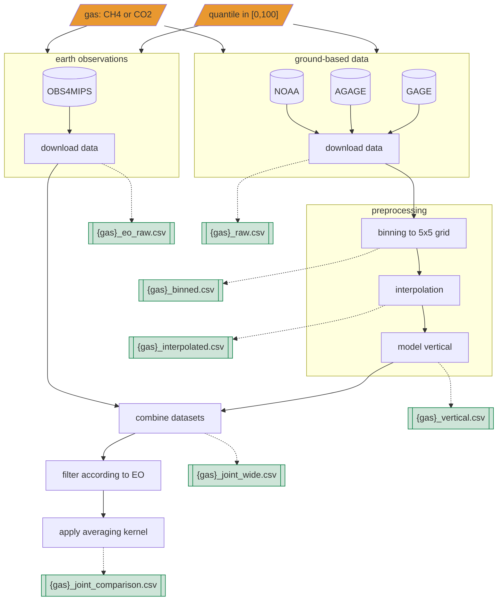

---8<--- "README.md:description"

```mermaid
graph TB
A01[/"gas: CH4 or CO2"/] --> ide1
A02[/"quantile in [0,100]"/] --> ide1
A01 --> ide2
A02 --> ide2
subgraph ide1[ground-based data]
id1[(NOAA)] --> A1[download data]
id2[(AGAGE)] --> A1[download data]
id3[(GAGE)] --> A1[download data]
end
subgraph ide3[preprocessing]
A1 --> B[binning to 5x5 grid]
B --> C[interpolation]
C --> D[model vertical]
end
subgraph ide2[earth observations]
id4[(OBS4MIPS)] --> A2[download data]
end
A2 --> E[combine datasets]
D --> E[combine datasets]
E --> F[filter according to EO]
F --> G[apply averaging kernel]
B -.-> B2[["{gas}_binned.csv"]]
C -.-> C2[["{gas}_interpolated.csv"]]
D -.-> D2[["{gas}_vertical.csv"]]
A2 -.-> A3[["{gas}_eo_raw.csv"]]
A1 -.-> A4[["{gas}_raw.csv"]]
E -.-> E2[["{gas}_joint_wide.csv"]]
G -.-> G2[["{gas}_joint_comparison.csv"]]
classDef data fill:#cee4d8,stroke:#007a3d;
class B2,C2,D2,A3,A4,E2,G2 data
classDef input fill:#e99830
class A01,A02 input
```
